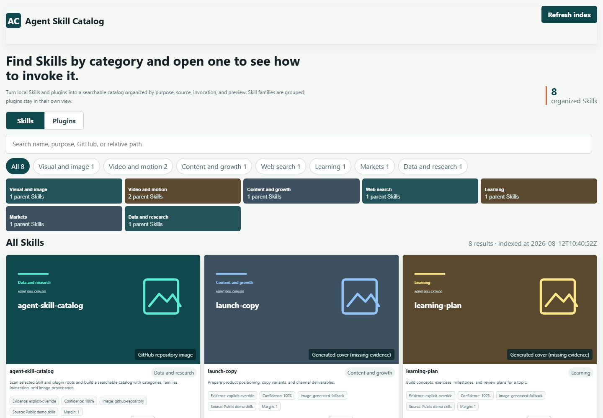
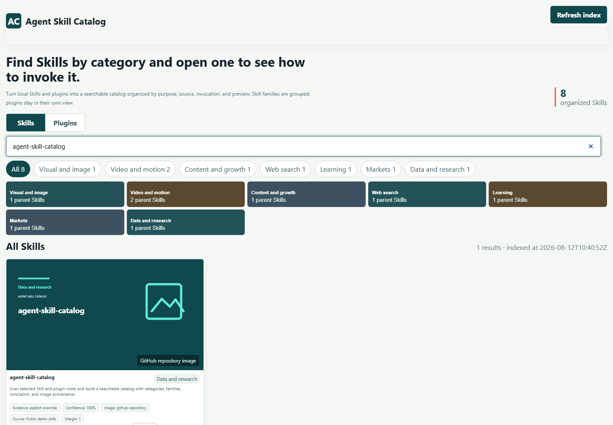
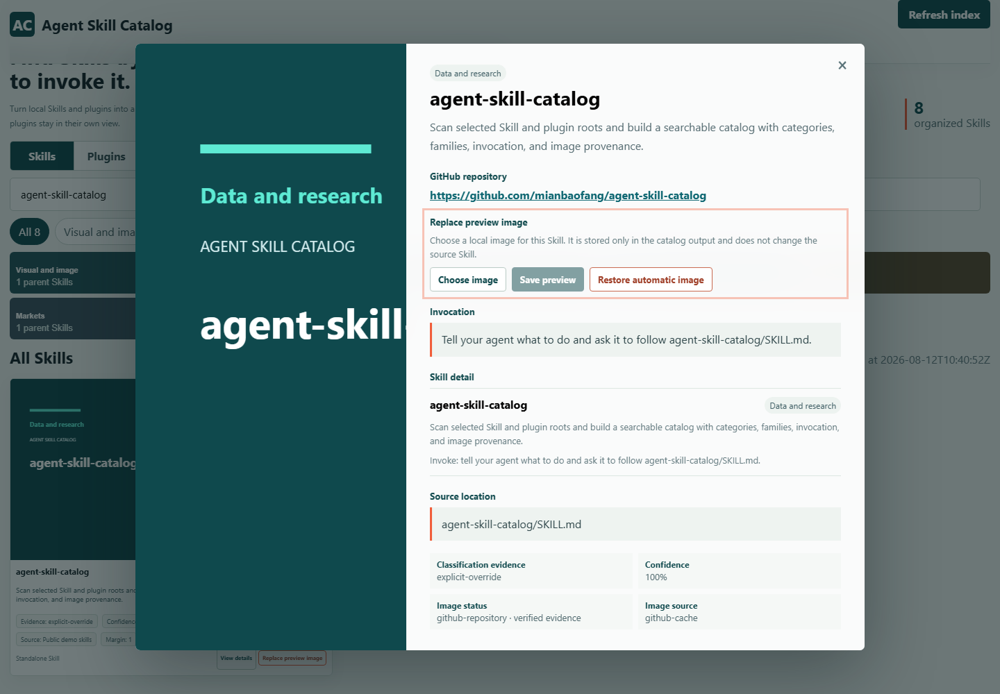

# Agent Skill Catalog

Agent Skill Catalog is a local Skill manager and Codex Skill catalog for people using AI coding agents. It scans explicit `SKILL.md` roots, merges verified copies and parent-child families, keeps plugins separate, collects GitHub previews, and has the invoking Agent finish missing Chinese descriptions.

<table align="center"><tr><td><a href="https://github.com/mianbaofang/agent-skill-catalog/releases/latest"></a></td><td><a href="https://github.com/mianbaofang/agent-skill-catalog/actions/workflows/validate.yml"></a></td><td><a href="LICENSE"></a></td><td><a href="https://github.com/mianbaofang/agent-skill-catalog/stargazers"></a></td></tr></table>

<p align="center">
  
  
  
  
  
</p>

<p align="center">
  <a href="docs/DEMO.md">
    
  </a>
</p>

<p align="center">
  <a href="README.zh-CN.md">中文</a>
  &middot;
  <a href="skills/agent-skill-catalog/SKILL.md">Skill</a>
  &middot;
  <a href="docs/DEMO.md">Product walkthrough</a>
  &middot;
  <a href="https://mianbaofang.github.io/agent-skill-catalog/">Project site</a>
  &middot;
  <a href="DISCLAIMER.md">Disclaimer</a>
  &middot;
  <a href="ACKNOWLEDGEMENTS.md">Acknowledgements</a>
  &middot;
  <a href="CHANGELOG.md">Changelog</a>
  &middot;
  <a href="SECURITY.md">Security</a>
</p>

## Quick Start

Install the published Skill with GitHub CLI:

```powershell
gh skill install mianbaofang/agent-skill-catalog agent-skill-catalog --agent codex --scope user
```

Then give the agent the roots to scan:

```text
Use agent-skill-catalog to scan my local Skill root and Codex plugin cache.
Keep standalone Skills and plugins separate, group real parent/child families,
resolve observed GitHub repositories for preview images, complete the Chinese
description queue from local and GitHub evidence, show low-confidence
classifications and missing image evidence, and do not install, edit, or
execute anything that was scanned.
```

## Why I Built This Skill

I installed a lot of image, video, research, and search Skills. When I wanted to make an image or check a web page, I could remember that something similar was installed but still had to move between several folders: was it a standalone Skill, a child of a parent Skill, or something supplied by a plugin? After finding a name, I still had to open `SKILL.md` to see whether it applied and how to invoke it.

A flat file list mixes parent Skills, child Skills, plugin-provided Skills, and standalone Skills. A category cover can be mistaken for a Skill preview when no real image is available. This project reads only the roots I choose and puts the relationships, classification notes, invocation text, image source, and GitHub URL into one local index.

Agent Skill Catalog is a read-only local catalog for people who maintain a large Skill and plugin library. It does not install, execute, edit, or upload scanned content.

> Read the [Disclaimer](DISCLAIMER.md) before use. This project is independent and is not affiliated with or endorsed by Codex, GitHub, or any listed Skill, plugin, provider, or repository.

## At A Glance

| Question | Answer |
|---|---|
| What does it scan? | Only the local roots explicitly supplied by the operator, including optional roots marked as plugin caches. |
| What is shown as one item? | A standalone Skill or a real parent/family record with its child Skills listed in the detail view. |
| What happens to duplicate installs? | Copies with the same observed GitHub repository and Skill name are shown once, while every source location remains available as evidence. |
| How are plugins shown? | Plugin aggregates have their own view and are not counted as standalone Skills. |
| What information is retained? | Category candidates, confidence, winner margin, source location, invocation text, image provenance, and an observed GitHub repository URL when available. |
| What happens when evidence is missing? | The catalog says `missing evidence`; it does not present a category cover as proof of a Skill-specific image. |
| What is the safety boundary? | Scanned roots stay read-only. The only optional network access is a size-limited public preview read from an observed GitHub repository; cached and manually selected images stay inside the chosen output directory. |

## What It Does

| Feature | What appears in the catalog |
|---|---|
| Classification | Category candidates, supporting notes, confidence, and a review flag for uncertain entries. Curation files can override a result. |
| Families | One parent entry with its source-consistent child Skills listed in the detail view. |
| Duplicate installs | Repository-backed copies of the same Skill are collapsed across scan roots without merging different plugins or conflicting repositories. |
| Plugins | Plugin-provided Skills grouped by provider and plugin name in a separate view. |
| Search and filtering | Search names, descriptions, GitHub metadata, and source-relative paths, then filter by category or view. |
| Description enrichment | A resumable `description_queue.py next/apply` loop supplies local `SKILL.md` and GitHub README evidence, validates the invoking Agent's Chinese copy, and resumes from completed batches after an interruption. |
| Images | Manual output-owned overrides first, then public GitHub repository previews resolved from installer/package evidence, Skill-provided local images, and a clearly labeled generated fallback. Family and plugin cards keep the best verified member image. |
| Manual image replacement | The detail view can save a selected image to the catalog output and restore the automatic image later without editing the source Skill. |
| GitHub URLs | A repository link appears when installer locks, injected frontmatter, package/plugin metadata, a Skill-body link, a local Git remote, a manifest, or reviewed curation provides it. Clicking a preview opens that repository. |
| Refresh | The local server rebuilds from the roots and curation files recorded at startup and rejects replacement inputs. |

## Operating Modes

| Mode | Use it when | Output |
|---|---|---|
| Static build | You only need a shareable local file | Deterministic `catalog.json` and self-contained `index.html`. |
| Local server | You want refresh and manual preview-image controls | The static catalog plus localhost-only `/api/refresh` and `/api/image` endpoints. |
| Reviewed curation | Automatic evidence is ambiguous | Scoped category, family, description, GitHub, or image overrides in a separate JSON file. Page-selected images use the output-owned curation file. |
| Plugin inventory | You scan a plugin cache | A separate plugin view with the Skills carried by each plugin. |

### Build From Source

Use Python 3.10+ to create a static catalog:

```powershell
python skills/agent-skill-catalog/scripts/build_catalog.py `
  --root "C:\path\to\skills" `
  --output-dir "$env:TEMP\agent-skill-catalog-output" `
  --require-complete-descriptions
```

Open the generated `index.html`. To use the in-page refresh action, start the local server with the same roots:

```powershell
python skills/agent-skill-catalog/scripts/serve_catalog.py `
  --output-dir "$env:TEMP\agent-skill-catalog-output" `
  --root "C:\path\to\skills" `
  --require-complete-descriptions
```

When a scanned Skill has an observed GitHub repository, the default build caches one public repository preview and reuses it for matching records. The recommended first command deliberately returns exit code 3 when Chinese copy still needs work. When invoked as a Skill, the Agent runs `description_queue.py next` to prepare bounded local and GitHub evidence, writes the Chinese response batch, applies it with `description_queue.py apply`, and resumes from `catalog-curation.json` until no items remain. It then rebuilds with `--refresh --require-complete-descriptions`; completion requires exit code 0 and `pending_description_count` equal to zero. The Python scripts do not call a hidden model or require a provider key. Add `--no-github-images` for a fully offline build. In server mode, the same gate prevents the refresh endpoint from falsely reporting a complete catalog.

To pin the current release:

```powershell
gh skill install mianbaofang/agent-skill-catalog agent-skill-catalog --pin v0.3.3 --agent codex --scope user
```

## Product Screenshots

<table align="center"><tr><td></td></tr></table>

<table align="center"><tr><td></td></tr></table>

<table align="center"><tr><td></td></tr></table>

## Safety And Responsible Use

- Scan roots are explicit and read-only; the builder does not traverse unrelated folders.
- Skill-provided remote image URLs remain metadata only. For an observed GitHub repository, the builder may read the public repository page and allowlisted GitHub image hosts to cache one size-limited, signature-checked preview.
- Manual preview images are written only to `curated-images/` and `catalog-curation.json` inside the selected output directory.
- Absolute paths are redacted by default. `--include-absolute-paths` is an intentional local diagnostic option.
- Refresh accepts only the roots, labels, kinds, config, and curation files that were recorded at startup.
- Category, family, image, and GitHub claims remain evidence-backed; uncertain records stay marked for review.

See the full [Disclaimer](DISCLAIMER.md) and [Security](SECURITY.md) notes before using the catalog with private or third-party Skill repositories.

## Acknowledgements

The project follows the public [Agent Skills specification](https://agentskills.io/specification) and uses Python's standard library for scanning, deterministic JSON generation, and the local HTTP server. The demo animation combines original explanatory information graphics with a real catalog UI recording made from non-personal local test data. The test Skill records and third-party private prompts or assets are not bundled.

See [Acknowledgements](ACKNOWLEDGEMENTS.md) for the attribution and non-affiliation boundary.

## Repository Layout

```text
skills/agent-skill-catalog/SKILL.md GitHub-discoverable Skill entry
skills/agent-skill-catalog/       versioned installable Skill package
skills/agent-skill-catalog/agents client and Yao Meta interface metadata
skills/agent-skill-catalog/references config, schemas, curation, and workflow
skills/agent-skill-catalog/scripts  scanner, HTML renderer, and bounded server
governance/agent-skill-catalog/ maintainer-only evaluation cases and release evidence
docs/media/                        README screenshots and product animation
tests/                             deterministic behavior checks
tools/                             package and release validation
.github/                           CI, issue, and pull-request templates
CHANGELOG.md                       release history
```

## Status / Release

- Current published release: [`v0.3.3`](https://github.com/mianbaofang/agent-skill-catalog/releases/tag/v0.3.3)
- Installable package: [`agent-skill-catalog-skill.zip`](https://github.com/mianbaofang/agent-skill-catalog/releases/latest/download/agent-skill-catalog-skill.zip)
- Package checksum: [`agent-skill-catalog-skill.zip.sha256`](https://github.com/mianbaofang/agent-skill-catalog/releases/latest/download/agent-skill-catalog-skill.zip.sha256)
- Validation: GitHub Skill discovery, package structure, Python compilation, deterministic catalog tests, and release packaging are run in CI and before release.
- Demo media: the README animation and screenshots are promotional previews, not install or runtime dependencies.

See the [Changelog](CHANGELOG.md) for version history.

## Author

Ethan <ethan.zl@hotmail.com>

## License

MIT.
