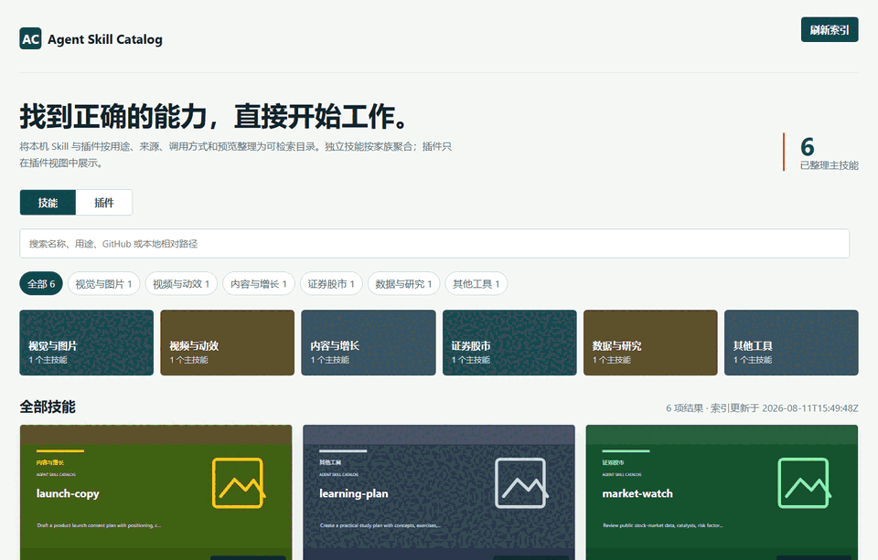
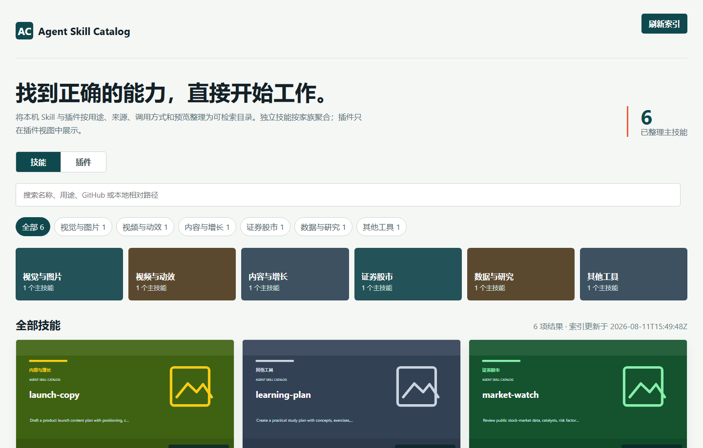
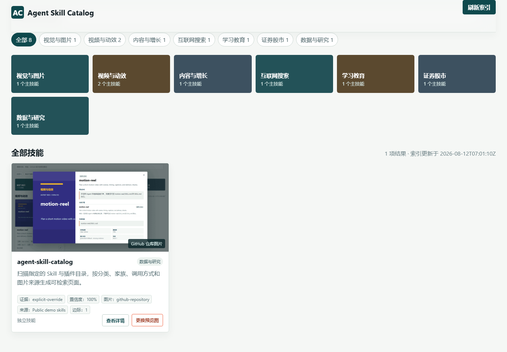
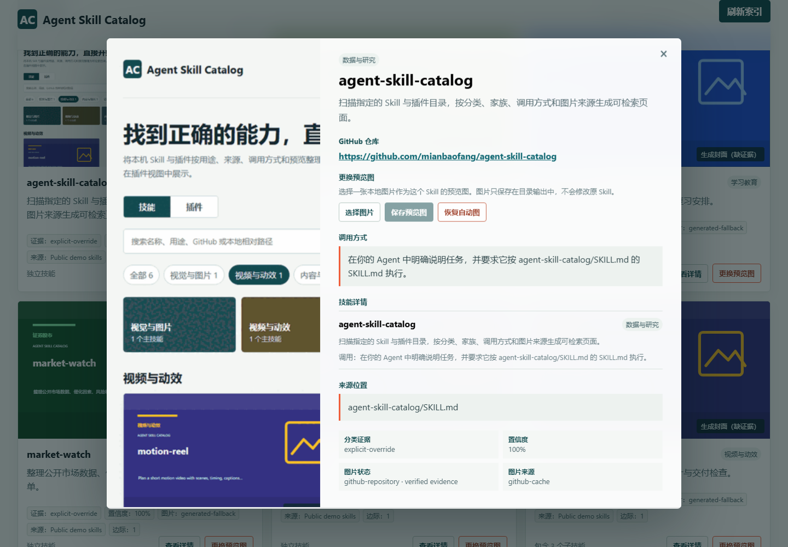

# Agent Skill Catalog 本地 Skill 与插件目录

给 Codex 和其他 AI 编程 Agent 用的本地 Skill 目录。它扫描明确指定的 `SKILL.md` 根目录，把同一主 Skill 下的子 Skill 收进一个条目，插件单独展示，并在详情里列出用途、调用方式和图片来源。

<table align="center"><tr><td><a href="https://github.com/mianbaofang/agent-skill-catalog/releases/latest"></a></td><td><a href="https://github.com/mianbaofang/agent-skill-catalog/actions/workflows/validate.yml"></a></td><td><a href="LICENSE"></a></td><td><a href="https://github.com/mianbaofang/agent-skill-catalog/stargazers"></a></td></tr></table>

<p align="center">
  
  
  
  
  
</p>

<p align="center">
  <a href="docs/DEMO.md">
    
  </a>
</p>

<p align="center">
  <a href="README.md">English</a>
  &middot;
  <a href="skills/agent-skill-catalog/SKILL.md">Skill</a>
  &middot;
  <a href="docs/DEMO.md">产品演示</a>
  &middot;
  <a href="DISCLAIMER.md">免责声明</a>
  &middot;
  <a href="ACKNOWLEDGEMENTS.md">致谢</a>
  &middot;
  <a href="CHANGELOG.md">更新记录</a>
  &middot;
  <a href="SECURITY.md">安全说明</a>
</p>

## 快速开始

通过 GitHub CLI 安装已发布的 Skill。

```powershell
gh skill install mianbaofang/agent-skill-catalog agent-skill-catalog --agent codex --scope user
```

安装后直接告诉 Agent 要扫描哪些目录。

```text
请使用 agent-skill-catalog 扫描我的本地 Skill 根目录和 Codex 插件缓存。
独立 Skill 与插件分开，真实主/子 Skill 家族聚合显示；标出低置信度分类和缺失图片证据。
不要安装、修改或执行任何被扫描内容。
```

## 为什么做这个 Skill

我装了很多图片、视频、研究和搜索 Skill。想做一张图或查一个网页时，明明记得装过类似工具，却得在几个目录之间来回找，确认它是独立 Skill、某个主 Skill 的子项，还是插件携带的能力。找到名字后，还要翻 `SKILL.md`，确认能不能用、该怎么说。

平铺文件列表会把主 Skill、子 Skill、插件携带的 Skill 和独立 Skill 放在一起。图片也有同样的问题，分类封面不一定是 Skill 自己的预览图。这个项目只读取选定的根目录，把目录关系、分类依据、调用方式、图片来源和 GitHub 地址放进同一份本地索引。

Agent Skill Catalog 是一个只读的本地目录工具，给维护大量本地 Skill 和插件的人用。它不安装、不执行、不修改，也不上传被扫描的内容。

> 使用前请阅读[免责声明](DISCLAIMER.md)。本项目独立维护，与 Codex、GitHub 以及目录中列出的 Skill、插件、服务商和仓库不存在从属、授权或背书关系。

## 一眼看懂

| 问题 | 回答 |
|---|---|
| 扫描什么？ | 只扫描操作者明确传入的本地根目录，也可以把插件缓存作为独立根目录标记。 |
| 什么会显示为一个条目？ | 一个独立 Skill，或一个详情里列出子 Skill 的真实主 Skill/家族记录。 |
| 插件怎么显示？ | 插件聚合有独立视图，不计入独立 Skill 的数量。 |
| 保留哪些信息？ | 分类候选、置信度、胜出边际、来源位置、调用方式、图片来源，以及能够从本地证据确认的 GitHub 仓库地址。 |
| 没有图片证据怎么办？ | 明确显示 `missing evidence`，不会把分类封面伪装成 Skill 专属图片。 |
| 安全边界是什么？ | 被扫描目录保持只读。可选网络访问只用于已确认 GitHub 仓库的公开预览图，缓存和手工选择的图片都留在输出目录。 |

## 能做什么

| 功能 | 页面里会看到什么 |
|---|---|
| 分类 | 列出候选分类、命中依据和置信度；低置信度条目会保留标记，也可以用整理文件覆盖。 |
| 家族 | 主 Skill 只占一个条目，详情里列出来源一致的子 Skill。 |
| 插件 | 按服务商和插件名聚合，在插件视图里单独查看，不计入独立 Skill 数量。 |
| 搜索和筛选 | 可搜名称、说明、GitHub 信息和相对来源路径，再按分类或视图筛选。 |
| 说明补全 | `description-enrichment.json` 标出缺失、过短或非中文说明；调用本 Skill 的 Agent 会读取源文件和公开仓库证据，把审核后的中文说明写入输出目录整理文件并重建。 |
| 图片 | 先用输出目录中的人工覆盖图，再取 GitHub 仓库公开预览、Skill 自带本地图，最后才显示带缺证据标记的说明封面。 |
| 手工改图 | 详情里可以选择图片并保存到目录输出，之后也能恢复自动图；不会改动源 Skill。 |
| GitHub 地址 | `gh skill install` 注入的 `metadata.github-repo`、frontmatter、Skill 正文链接、本地 Git remote、manifest 或人工整理都可以作为确认来源；点击预览图可直接打开仓库。 |
| 刷新 | 本地服务沿用启动时的根目录和整理文件重建页面；输入被替换时会拒绝刷新。 |

## 使用方式

| 模式 | 什么时候用 | 输出 |
|---|---|---|
| 静态生成 | 只需要一个可分享的本地页面 | 确定性的 `catalog.json` 和自包含 `index.html`。 |
| 本地服务 | 需要刷新和手工改图 | 静态目录加仅监听 localhost 的 `/api/refresh` 与 `/api/image` 接口。 |
| 人工整理 | 自动证据存在歧义 | 单独 JSON 文件中的分类、家族、说明、GitHub 或图片覆盖；页面选择的图片写入输出目录自己的整理文件。 |
| 插件清单 | 扫描插件缓存 | 独立插件视图，以及每个插件携带的 Skill 清单。 |

### 从源码生成目录

需要 Python 3.10+。以下命令只生成静态目录。

```powershell
python skills/agent-skill-catalog/scripts/build_catalog.py `
  --root "C:\path\to\skills" `
  --output-dir "$env:TEMP\agent-skill-catalog-output"
```

生成后直接打开 `index.html`。页面内需要“刷新索引”按钮时，使用同一批根目录启动本地服务。

```powershell
python skills/agent-skill-catalog/scripts/serve_catalog.py `
  --output-dir "$env:TEMP\agent-skill-catalog-output" `
  --root "C:\path\to\skills"
```

扫描到能够确认的 GitHub 仓库时，默认会缓存一张公开仓库预览图。首次生成还会写出 `description-enrichment.json`；请逐项对照源 `SKILL.md` 和公开仓库 README，把自然中文说明写入输出目录的 `catalog-curation.json`，再用 `--refresh` 重建，直到待补数量归零或明确标记缺少证据。完全离线生成时，给 `build_catalog.py` 增加 `--no-github-images`。本地服务模式下，可以在详情里手工替换预览图，也可以恢复自动图。

固定到当前发布版本时使用下面的命令。

```powershell
gh skill install mianbaofang/agent-skill-catalog agent-skill-catalog --pin v0.3.0 --agent codex --scope user
```

## 产品截图

<table align="center"><tr><td></td></tr></table>

<table align="center"><tr><td></td></tr></table>

<table align="center"><tr><td></td></tr></table>

## 安全与责任边界

- 扫描根目录由操作者明确给出，并保持只读；构建器不会遍历无关目录。
- Skill 自己声明的远程图片地址仍然只保留为元数据。确认到 GitHub 仓库后，构建器只访问公开仓库页面和允许的 GitHub 图片域名，下载内容有大小限制并检查图片签名。
- 手工预览图只写入输出目录的 `curated-images/` 与 `catalog-curation.json`。
- 默认隐藏绝对路径；只有明确的本地诊断任务才使用 `--include-absolute-paths`。
- 刷新只接受启动时记录的根目录、标签、类型、配置和整理文件。
- 分类、家族、图片和 GitHub 说明都来自扫描结果或整理文件；无法确认的记录会保留复核标记。

完整边界见[免责声明](DISCLAIMER.md)和[安全说明](SECURITY.md)。

## 致谢

项目遵循公开的 [Agent Skills 规范](https://agentskills.io/specification)，扫描、确定性 JSON 生成和本地 HTTP 服务只使用 Python 标准库。README 动画由原创信息图与真实目录 UI 录屏组成，录制使用不含个人清单的本地测试数据；这些测试 Skill、第三方私有提示词和私有资产都不会随仓库发布。

完整归属与非从属说明见[致谢](ACKNOWLEDGEMENTS.md)。

## 仓库结构

```text
skills/agent-skill-catalog/SKILL.md GitHub 可发现的 Skill 入口
skills/agent-skill-catalog/       版本化可安装 Skill 包
skills/agent-skill-catalog/agents 客户端和 Yao Meta 接口元数据
skills/agent-skill-catalog/references 配置、Schema、整理和工作流
skills/agent-skill-catalog/scripts   扫描器、HTML 渲染器和受限服务
docs/media/                        README 截图和产品动画
tests/                             确定性行为检查
tools/                             包和发布校验
.github/                           CI、Issue 和 PR 模板
CHANGELOG.md                       版本记录
```

## 状态 / 发布

- 当前已发布版本是 [`v0.3.0`](https://github.com/mianbaofang/agent-skill-catalog/releases/tag/v0.3.0)。
- 可安装包是 [`agent-skill-catalog-skill.zip`](https://github.com/mianbaofang/agent-skill-catalog/releases/latest/download/agent-skill-catalog-skill.zip)。
- 包校验文件是 [`agent-skill-catalog-skill.zip.sha256`](https://github.com/mianbaofang/agent-skill-catalog/releases/latest/download/agent-skill-catalog-skill.zip.sha256)。
- 校验范围包括 GitHub Skill 发现、安装包结构、Python 编译、目录测试和发布打包，CI 与发布前都会运行这些检查。
- README 动画和截图只是产品预览，不是安装或运行依赖。

版本历史见[更新记录](CHANGELOG.md)。

## 作者

Ethan <ethan.zl@hotmail.com>

## License

MIT.
